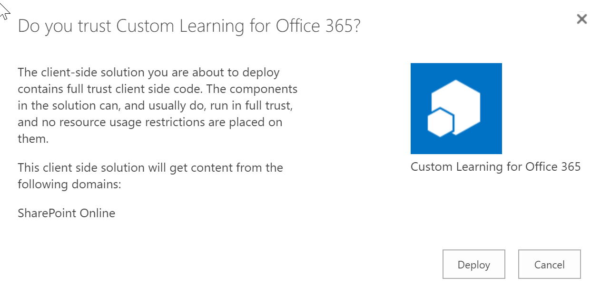

# Custom Learning for Office 365

Train employees with Custom Learning for Office 365, a digital, customizable learning solution that helps customers transform their organization. Custom Learning for Office 365 provides:

- Comprehensive end user training content: product and scenario-based training, in video and article format
- Easy to install: Deploy from the [SharePoint Provisioning Service](https://provisioning.sharepointpnp.com) within minutes and without any coding
- Easily customizable: Hide and show content to align with how you have set up Office 365 in your environment
- Create your own training playlists: Add your own custom training content and playlists to feature your organization-specific scenarios
- Always up-to-date content: As Office 365 changes, the Custom Learning for Office 365 content will be updated. Content updates will be made and communicated to customers on a monthly basis

## Prerequisites

- You will need to be a tenant administrator to be able to deploy this solution to the target tenant.
Note that you can get free developer tenant from [Office 365 developer program](https://developer.microsoft.com/en-us/office/dev-program), if needed
- Automatic end-to-end provisioning only works with English tenants. All solutions and web parts are also English in the current implementation
- A tenant `App Catalog` must have been created within the `Apps` option of the SharePoint Admin Center. Please see [Set up your Office 365 tenant](https://docs.microsoft.com/en-us/sharepoint/dev/spfx/set-up-your-developer-tenant#create-app-catalog-site) and follow the Create app catalog site section. If your tenant-wide App Catalog has already been provisioned, you will need access to an account that has rights to upload a package to it to complete this setup process. Generally, this is an account with the SharePoint administrator role. If an account with that role does not work, go to the SharePoint admin center and find the Site Collection Administrators for the app catalog site collection and either log in as one of the Site Collection Administrators, or add the SharePoint administrator account that failed to the Site Collection Administrators. You will also need access to an account that is a SharePoint Tenant Admin.

## Author(s)

Peter Krebs 
Julie Turner (Sympraxis Consulting) - [@jfj1997](https://twitter.com/jfj1997)

## Disclaimer

THIS CODE IS PROVIDED AS IS WITHOUT WARRANTY OF ANY KIND, EITHER EXPRESS OR IMPLIED, INCLUDING ANY IMPLIED WARRANTIES OF FITNESS FOR A PARTICULAR PURPOSE, MERCHANTABILITY, OR NON-INFRINGEMENT.

## Updating the solution

### Current Release Version

The current solution is provided in it's packaged form in the webpart folder [customlearning.sppkg](./webpart/customlearning.sppkg).

To validate the version of the webpart installed in your tenant you must have access to the tenant-wide App Catalog. The custom learning solution will be installed there and you can verify the current version number against the version number noted above.

If you find that your package is out of date, you can download it from this repository and then upload it into your tenant app catalog (you will need appropriate access to do this step). Upload this file into the app catalog by selecting upload, finding the file, and then selecting Deploy.

If you've updated the package you will also want to update it in the custom learning site collection. Navigate to the site collection that is your custom learning master site, then site contents, and then click on the menu for `Custom Learning for Office 365` and select Details.

If your application needs to be updated in this site colleciton you will see that there is a new versoin and you can select the `Get It` link to update.

## Manually installing and configuring Custom Learning for Office 365

### Sharepoint Framework Version

The Microsoft Custom Learning Web Part is build using the [SharePoint Framework](https://docs.microsoft.com/en-us/sharepoint/dev/spfx/sharepoint-framework-overview). To manually install and configure the web part and site collection you will need to complete the steps outlined in the [Manual Custom Learning Install Instructions](./webpart/ManualCustomLearningInstall.md)

## Disabling telemetry collection

Microsoft collects active usage data from your organization’s use of Custom Learning for Office 365. Microsoft will use this data to help improve the future Custom Learning for Office 365 solutions. To learn more about Microsoft privacy policies see [https://go.microsoft.com/fwlink/?LinkId=521839](https://go.microsoft.com/fwlink/?LinkId=521839).

If you would like to opt out of this data collection, please follow these instructions:

1. Go to script `CustomLearningConfiguration.ps1`.
1. Change the `$optInTelemetry = $true` command line to `$false`.
1. Run the script with the change implemented.

If you are not performing a manual install and would like to turn telemetry tracking off, a separate script `TelemetryOptOut.ps1` has been included that when run will disable telemetry tracking.

## Contributions

User contributions to Custom Learning for Office 365 are currently not being accepted.  

## Getting Help

If you find you're having difficulty installing the solution, have found what you believe is a bug, or just have general questions please submit an issue in the repository. We try to monitor and respond to issues as fast as you can.
