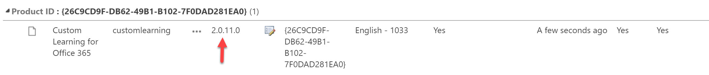
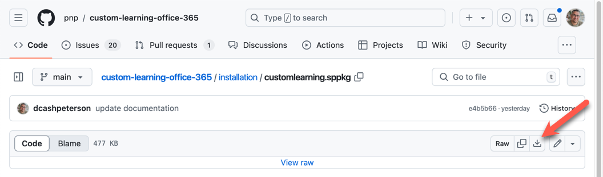
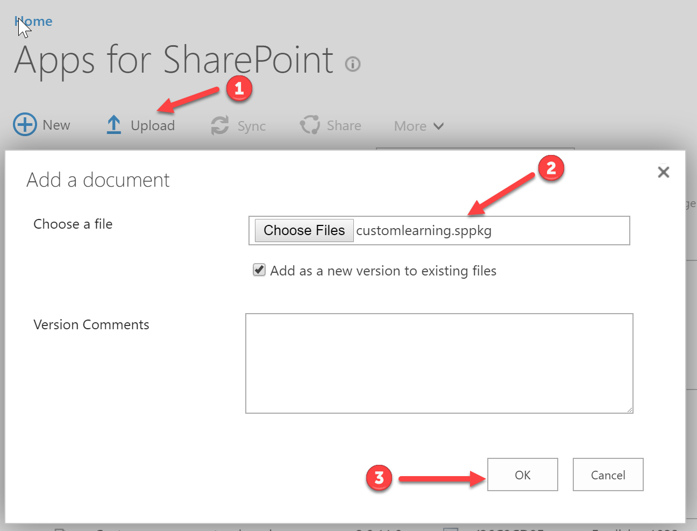
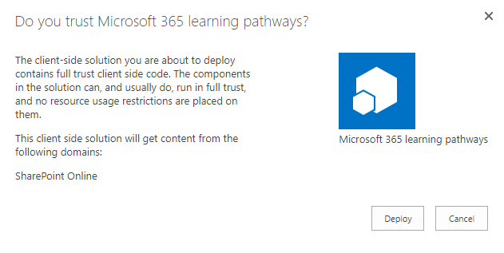
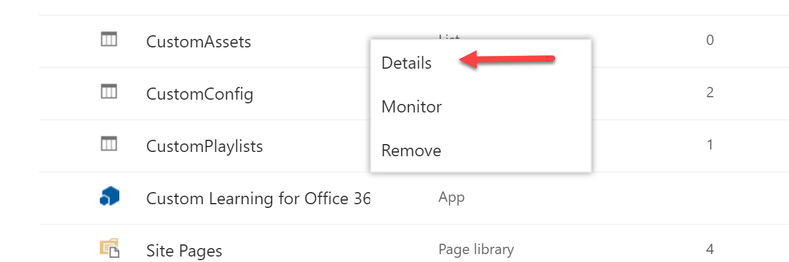
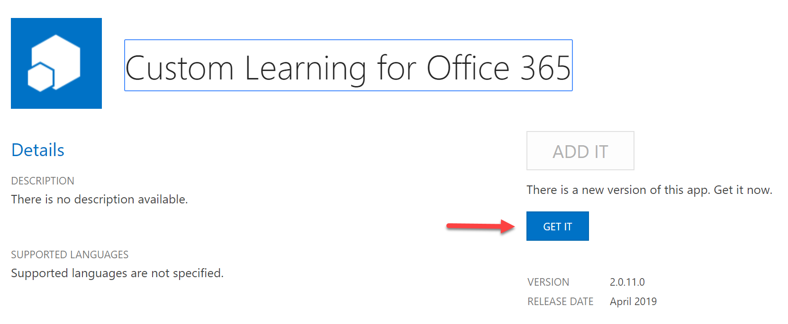

# Microsoft 365 learning pathways

Train employees with Microsoft 365 learning pathways, a digital, customizable learning solution that helps customers transform their organization. Microsoft 365 learning pathways provides:

- Comprehensive end user training content: product and scenario-based training, in video and article format
- Easy to install: Deploy from the [SharePoint look book](https://lookbook.microsoft.com) within minutes and without any coding
- Easily customizable: Hide and show content to align with how you have set up Office 365 in your environment
- Create your own training playlists: Add your own custom training content and playlists to feature your organization-specific scenarios
- Always up-to-date content: As Office 365 changes, the Microsoft 365 learning pathways content will be updated. Content updates will be made and communicated to customers on a monthly basis

## Overview Video

A video was recorded during a PnP Monthly Community call and that video is available here: [Community Demo - Microsoft 365 Learning Pathways Architectural Overview](https://www.youtube.com/watch?v=-sLXl_rKGxQ). It may help you gain a better understanding of what Microsoft 365 learning pathways is and how to go about using it.

In addition there is a new recording showing an overview of the V4 multilingual release available here: [Microsoft 365 learning pathways v4 Feature Overview](https://youtu.be/xayqnUAcGXc)

## Prerequisites

- You will need to be a tenant administrator to be able to deploy this solution to the target tenant.
Note that you can get free developer tenant from [Office 365 developer program](https://developer.microsoft.com/en-us/office/dev-program), if needed
- Automatic end-to-end provisioning only works with English tenants. With the version 4.x.x release, web parts are available in multiple languages, for more information see [Overview of multilingual support for learning pathways](https://docs.microsoft.com/en-us/office365/customlearning/custom_overview_ml).
- A tenant `App Catalog` must have been created within the `Apps` option of the SharePoint Admin Center. Please see [Set up your Office 365 tenant](https://docs.microsoft.com/en-us/sharepoint/dev/spfx/set-up-your-developer-tenant#create-app-catalog-site) and follow the Create app catalog site section. If your tenant-wide App Catalog has already been provisioned, you will need access to an account that has rights to upload a package to it to complete this setup process. Generally, this is an account with the SharePoint administrator role. If an account with that role does not work, go to the SharePoint admin center and find the Site Collection Administrators for the app catalog site collection and either log in as one of the Site Collection Administrators, or add the SharePoint administrator account that failed to the Site Collection Administrators. You will also need access to an account that is a SharePoint Tenant Admin.

## Author(s)

- Peter Krebs
- Julie Turner (Sympraxis Consulting) - [@jfj1997](https://twitter.com/jfj1997)

## Disclaimer

THIS CODE IS PROVIDED AS IS WITHOUT WARRANTY OF ANY KIND, EITHER EXPRESS OR IMPLIED, INCLUDING ANY IMPLIED WARRANTIES OF FITNESS FOR A PARTICULAR PURPOSE, MERCHANTABILITY, OR NON-INFRINGEMENT.

## Updating the solution

### Current Release Version

For a list of issues/updates made in each release see the [CHANGELOG](CHANGELOG.md).

>**CRITICAL: Version 4.x.x Upgrade Notice**
>
>The version 4.x.x version is a major update and includes changes to the schema as well as support for multilingual pages.

>**_PLEASE_** review the content of [Adding Multilingual Support to Microsoft 365 learning pathways](./installation/AddingMultilingualSupport.md) document before proceeding.

>Although it has been tested thoroughly, as with any major update you should plan for the worst and back up your content first. There are many third party solutions that will assist you with this, if you do not have access to any then the simplest method is to back up your content using Microsoft Excel. Specifically all the items in the _CustomPlaylists_ and _CustomAssets_ lists plus the `CustomSubCategories` item in the _CustomConfig_ list. Please see [Backup Playlist Content](./installation/BackupInstructions.md) for more detail instructions.
>
>*Additional Update for CDN Url*
>
>The base CDN url of the web part has changed in version 3.x.x. For the majority of users the web part will handle this change internally, however, in some instances customers who have installed learning pathways manually between July 27, 2019 and November 4, 2019 may have an invalid CDN endpoint. If after updating to version 3.x.x the content won't load, please run the [UpdateM365lpCDN.ps1](./installation/UpdateM365lpCDN.ps1) PowerShell script to correct the CDN endpoint. Even if you do not have a problem, you may optionally run this script to update to the most optimized CDN url.

The current solution is provided in it's packaged form in the web part folder [customlearning.sppkg](./installation/customlearning.sppkg).

To validate the version of the web part installed in your tenant you must have access to the tenant-wide App Catalog. The custom learning solution will be installed there and you can verify the current version number against the **_version number noted above_** (not the version in the screen shot).

If you find that your package is out of date, you can download it from this repository and then upload it into your tenant app catalog (you will need appropriate access to do this step).

To download the SPPKG file, navigate to the [customlearning.sppkg](https://github.com/pnp/custom-learning-office-365/blob/main/installation/customlearning.sppkg) file in the webpart folder of this repository. Select `Download` to save the file to your computer.

Upload this file into the app catalog by selecting upload, finding the file, and then selecting Deploy.

If you've updated the package you will also want to update it in the custom learning site collection. Navigate to the site collection that is your custom learning main site, then site contents, and then click on the menu for `Microsoft 365 learning pathways` and select Details. (Previously called Custom Learning for Office 365)

If your application needs to be updated in this site collection you will see that there is a new version and you can select the `Get It` link to update.

Finally, in your main custom learning site, navigate to the Site Pages library and to the `CustomLearningAdmin.aspx` page. Make sure this admin page load successfully without error. You may be prompted to complete a 'Data Upgrade' if you are updating to a new major version of the solution. Please run the update and assuming everything works as expected you would then close the update and the admin web part will load the content. If you have problems at this point, please open a new issue for assistance.

## Manually installing and configuring Microsoft 365 learning pathways

We encourage you to install the Microsoft 365 learning pathways solution using the [SharePoint look book](https://lookbook.microsoft.com/), however we recognize that the permissions that service require are significant and not all organizations will feel comfortable utilizing it. To that end this section outlines a manual method of installing the solution. After complete, updates can be applied by following the section above for [Updating the solution](#Updating-the-solution).

### SharePoint Framework Version

The Microsoft Custom Learning Web Part is build using the [SharePoint Framework](https://docs.microsoft.com/en-us/sharepoint/dev/spfx/sharepoint-framework-overview). To manually install and configure the web part and site collection you will need to complete the steps outlined in the [Manually installing and configuring Microsoft 365 learning pathways Instructions](./installation/README.md)

## Disabling telemetry collection

Microsoft collects active usage data from your organization’s use of Microsoft 365 learning pathways and the use of Microsoft’s online content. Microsoft will use this data to help improve the future Microsoft 365 learning pathways solutions. To learn more about Microsoft privacy policies see [https://go.microsoft.com/fwlink/?LinkId=521839](https://go.microsoft.com/fwlink/?LinkId=521839).

If you would like to opt out of this data collection, please follow these instructions:

1. Go to script `M365lpConfiguration.ps1`.
1. Change the `$optInTelemetry = $true` command line to `$false`.
1. Run the script with the change implemented.

If you are not performing a manual install and would like to turn telemetry tracking off, a separate script `TelemetryOptOut.ps1` has been included that when run will disable telemetry tracking.

## Changing the URL of your Microsoft 365 learning pathways site

If you need to rename the url of the main Microsoft 365 learning pathways site you can do so but it will also require you to run a PowerShell script to update the Tenant App property that controls what that site URL is for the web parts. After renaming the URL in the SharePoint Admin Center or via PowerShell additionally run teh following script to update the Tenant App property.
[UpdateM365lpSiteUrl.ps1](./installation/UpdateM365lpSiteUrl.ps1)

## Contributions

- At this time **NO** pull-requests will be accepted for the `docs` folder.
- Target your pull requests to the **dev** branch
- Keep your pull-requests as simple as possible and describe the changes to help the reviewer understand your work
- If you have an idea for a larger change to the library please [open an 'Enhancement Idea'](https://github.com/pnp/custom-learning-office-365/issues) and let's discuss before you invest many hours - these are very welcome but want to ensure it is something we can merge before you spend the time :)

## Getting Help

If you find you're having difficulty installing the solution, have found what you believe is a bug, or just have general questions please submit an issue in the repository. We try to monitor and respond to issues as fast as you can.

### Issue List Etiquette

- This repository is set up to handle three issue types, please choose the one that best represents your reason for submitting (Question, Bug, Enhancement) and then please attempt to fill in the issue template as best as you can. We have created them to help us help expedite a solution.
- Please **DO NOT** submit a response to a closed issue. If you have the same issue, or a related issue please start a new issue and reference the closed issue(s) by using the pound (#) sign and the issue number, e.g. Related to #1. If you respond to a closed issue you will either not get a response or you may eventually be asked to submit a new issue as we will prioritize open issues.

## Code of Conduct

This project has adopted the [Microsoft Open Source Code of Conduct](https://opensource.microsoft.com/codeofconduct/). For more information see the [Code of Conduct FAQ](https://opensource.microsoft.com/codeofconduct/faq/) or contact [opencode@microsoft.com](mailto:opencode@microsoft.com) with any additional questions or comments.

### "Sharing is Caring"
