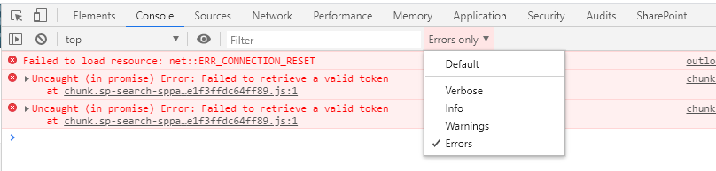
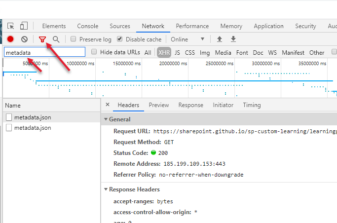
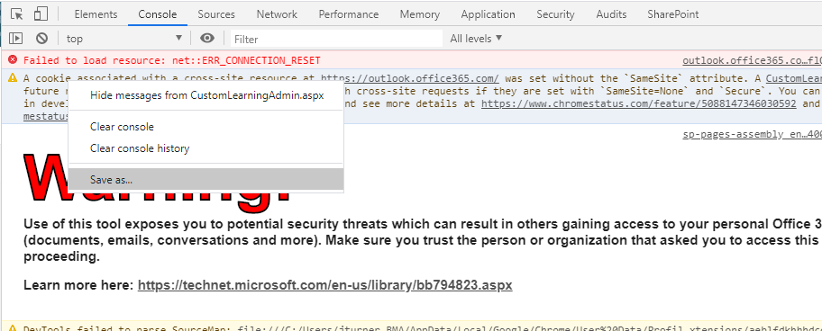

# Diagnosing “Microsoft 365 learning pathways has a configuration issue. Ask your administrator for assistance.” Pre-Check

1. Open the developer console in the browser. You can normally do this by pressing F12, which works on most browsers including Chrome, Chromium Edge, IE, Edge, etc...
1. Always do the diagnosis from the M365 learning pathways admin page, unless you're having the problem only on a particular instance of the web part. To get to the admin page, in the Site Pages library of the main learning pathways site open the “CustomLearningAdmin.aspx” page.
1. Once the page loads, filter the `Console` to only show error messages. Doing so can help you zero in on the exact issue. Note that there are a lot of errors in the console that come from other things, it's important that you separate out for only issues related to learning pathways, they will be clearly labeled as such.

   

1. If the console errors don't give a clue or there aren't any errors, switch to the `Network` tab and filter for metadata.json, validate that it’s loading successfully. If it is clear the filter and scroll through looking for any other errors.

   

1. If you cannot diagnose the issue based on steps 3 and 4, submit a new [Bug report](https://github.com/pnp/custom-learning-office-365/issues/new/choose) issue. Please follow the template to provide as much information as possible about any errors you saw in the browsers dev tools console or network tab. You may be asked to provide a copy of the browser console log. To do so set the filter back to "Default" and reload the page so the entire page cycle is loaded in the console. Next, right click on the body of the console and select `Save as...` to export the log to a file and follow the directions you'll be given to share that file with support.

   

Thank you in advance for reviewing these procedures before you submit your issue.  When you do, it greatly reduces the time it takes for the team to provide a solution for you!

Sharing is caring!
