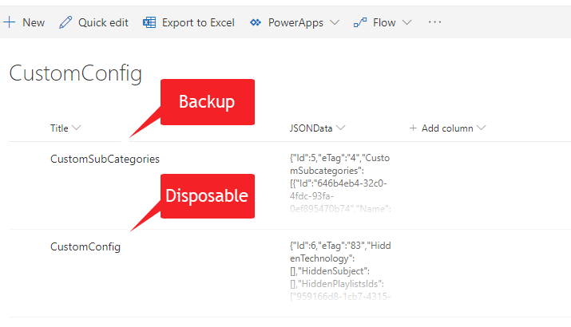
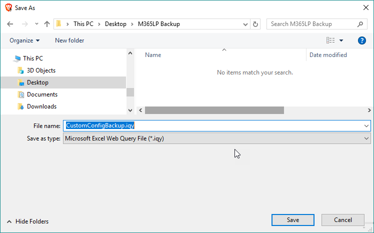
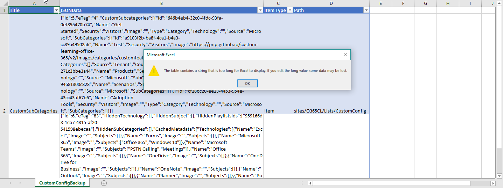

# Backup custom content for Microsoft 365 learning pathways

All custom content for Microsoft 365 learning pathways is stored in lists in the master learning pathways site collection. Navigate to the `Site Contents` list of your site and locate the following lists:

1. CustomConfig: If you've created custom sub-categories there will be a list item called `CustomSubCategories`, that list item should be backed up.

>When backing up this list the CustomConfig list item is too long and will give an error, this is ok as this list item is completely disposable it is simply the cache of content from Microsoft merged with the custom content created in the site. It will regenerate itself automatically, but do not delete it before performing the upgrade.

1. CustomPlaylists: Backup all items in this list.
1. CustomAssets: Backup all items in this list.

## Backup a SharePoint list using Microsoft Excel

To backup a SharePoint list, navigate to the list and select `Export to Excel` from the command bar.

When prompted, save the `iqry` file to your local machine. It's useful to name the file for the list you're exporting.

Open the iqy file by double clicking on it, which will launch Microsoft Excel.
The data will be imported into the workbook.

Save the Excel file with the appropriate name based on the list exported.

## Here are a couple other more advanced ideas for backing up the data from SharePoint lists

1. Create a flow that's manually triggered that reads all the items from the list and writes them into a list in another site, preserving the list item's ID as a column as well as the JSONData as a column so that if necessary the process can be reversed.

1. Temporarily enable custom scripting in the site which will light up the "Save List as Template" feature. The lists can then be saved as templates with data.
